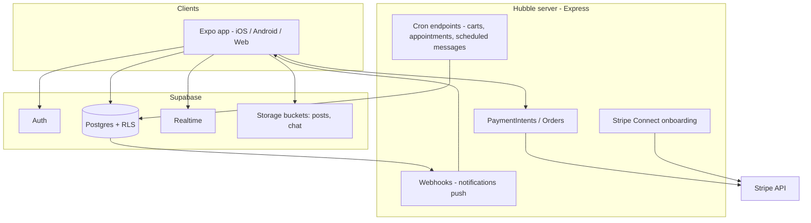

# Hubble

Hubble is a cross-platform creator economy app built with **Expo** (React Native) and **Expo Router**. It combines a social feed, marketplace, messaging with CRM, wallet and payouts, TV-style media sections, storage for owned content, and creator tooling — all backed by **Supabase** (Postgres, Auth, Storage, Realtime) and a small **Express** payments server for **Stripe**.

Target platforms: **iOS**, **Android**, and **web** (static export via Metro).

---

## Table of contents

- [Architecture overview](#architecture-overview)
- [Features](#features)
- [Tech stack](#tech-stack)
- [Prerequisites](#prerequisites)
- [Quick start](#quick-start)
- [Environment variables](#environment-variables)
- [Supabase setup](#supabase-setup)
- [Payments server](#payments-server)
- [Push notifications](#push-notifications)
- [Project structure](#project-structure)
- [Routing and navigation](#routing-and-navigation)
- [State and data layer](#state-and-data-layer)
- [Database schema (summary)](#database-schema-summary)
- [Messaging system](#messaging-system)
- [Scripts and npm commands](#scripts-and-npm-commands)
- [Development notes](#development-notes)
- [Troubleshooting](#troubleshooting)
- [Contributing](#contributing)
- [Related documentation](#related-documentation)

---

## Architecture overview



| Layer | Role |
|-------|------|
| **Expo app** | UI, navigation, Supabase client (anon key), Stripe Payment Sheet (native builds), push token registration |
| **Supabase** | Users, profiles, posts, products, orders, messaging, notifications, TV content, RLS policies |
| **Hubble server** | Stripe secrets, order confirmation, payouts, webhooks, cron jobs that need service role |
| **Stripe** | Payments, Connect transfers to creators |

Without Supabase env vars, auth and data features are disabled (dev warning in console). Without Stripe env vars, tips and checkout fall back to a mock alert-only flow.

---

## Features

### Social feed (`/(tabs)/feed`)

- Paginated post feed with multiple sort modes: **For you** (ranked), newest, most liked, most commented, oldest, random
- **For you** ranking uses `lib/feed-ranking.ts` (recency decay, reputation, token boosts, configurable weights)
- Community filter via top bar (see [Communities](#communities))
- Post interactions: like, dislike, repost, comments, watch-time reporting, tips (Stripe)
- Stories, hashtags, location-aware discovery hooks
- **Algorithm** screen (`/algorithm`) for user-controlled feed preferences (post types, more/less topic signals stored in AsyncStorage)
- Report profiles, share posts, fullscreen video modal

### Creator Studio (`/(tabs)/create`)

- Create and schedule posts (blog, picture, video, audio)
- Product and event creation tied to `ContentContext` and Supabase `products` / `events`
- Media upload via `lib/postUpload.ts`, hashtags via `lib/hashtags.ts`
- Revenue splits when publishing (`lib/revenue-splits.ts`)

### Profile and creators

- Tabbed profile: posts, products, events, saved
- Public creator pages: `/creator/[id]`
- Edit profile, edit post/product
- Stories viewer: `/story-viewer/[userId]`
- Tag pages: `/tag/[name]`
- Referral links (`?ref=`) captured at launch; clicks recorded in `referral_events`
- DM access grants and paid DM settings on profiles

### Marketplace (`/(tabs)/marketplace`)

- Shop, wishlist, and cart views (cart/wishlist also reachable as hidden tab routes)
- Product discovery with categories (physical, digital, services, NFT, B2B, etc.) and `lib/discovery.ts` ranking
- Location-based distance when permission granted
- Checkout via Stripe Payment Sheet when `EXPO_PUBLIC_STRIPE_PUBLISHABLE_KEY` is set
- Promo codes validated through server `POST /validate-coupon`
- Orders flow: `create-payment-intent` → Payment Sheet → `confirm-order` on server

### Wallet (`/(tabs)/wallet`)

- Multi-section layout: overview, fiat vault, crypto vault (UI), escrow dashboard, transaction ledger
- Orders and creator payouts from Supabase
- Stripe Connect onboarding via server `POST /connect/onboard`
- Delivery confirmation and escrow-related server endpoints
- Responsive layout via `lib/wallet-grid.ts` (sidebar + detail on wide screens)

### Messaging (`/(tabs)/messages`)

- **Desktop-style split view**: left panel (~⅓ width) conversation list, right panel chat
- Direct and group conversations; categories: all, priority, main, groups, escrow, bookings
- Realtime messages and reactions; reply threads; voice notes (`expo-audio`); file attachments (`lib/chatUpload.ts` → `chat` storage bucket)
- **CRM panel** per conversation: orders as buyer/creator, contact meta (`hooks/useCRMData.ts`)
- Inline **invoice** and **escrow** message cards
- Scheduled messages (`scheduled_messages` table + server cron `POST /cron/send-scheduled-messages`)
- Appointments / book meeting from chat
- Presence (`hooks/usePresence.ts`); new DM via `create_dm_conversation` RPC
- Conversation list caching: in-memory + AsyncStorage (`hooks/useConversations.ts`)

### Notifications (`/(tabs)/notifications`)

- In-app notification list with Realtime subscription
- Types: likes, comments, follows, reposts, orders, messages, appointments, etc.
- Push tokens stored in `push_tokens`; OS push via server webhook on `notifications` INSERT (see [Push notifications](#push-notifications))

### TV (`/(tabs)/tv`)

- Three sections: **Broadcast**, **Stations**, **Cinema** (horizontal sub-navigation)
- Data from `lib/tv-broadcasts.ts`, `lib/tv-stations.ts`, `lib/tv-cinema.ts` and Supabase tables `broadcasts`, `stations`, `cinema_content`
- “My” content browse integrated with owned storage items
- Hidden tab route: `/(tabs)/cinema` for dedicated cinema entry if linked

### Storage (`/(tabs)/storage`)

- Visual storage sphere and category grid (cinema, broadcasts, stations, closet, music, products, art, library, documents, photo, videos, all)
- Owned items from `lib/owned-items.ts`; drill-down: `/storage/[category]`
- Upgrade flow: `/upgrade-storage`

### Insights and revenue

- `/insights/income`, `/insights/engagement` — analytics widgets (`lib/analytics-income.ts`, `lib/analytics-engagement.ts`)
- `/revenue-splits` — manage partner revenue splits on products
- `/orders` — order history

### Auth (`/(auth)`)

- Email/password sign-in and sign-up via Supabase Auth
- `AuthGate` in root layout redirects unauthenticated users to login and signed-in users away from auth routes
- Profile row auto-upserted on sign-in (`lib/supabase-profiles.ts`)

### Top bar (`HudTopBar`)

Visible on main tabs. Shortcuts:

- **Creator Studios** → create tab
- **Messages**, **Community picker**, **Notifications** (badge), **Wallet**

Tab bar (visible): feed, marketplace, profile, TV, storage. Hidden from tab bar but routed: messages, notifications, wallet, cart, wishlist, create, cinema, index redirect.

---

## Tech stack

| Category | Libraries / services |
|----------|----------------------|
| Framework | Expo SDK 54, React 19, React Native 0.81, Expo Router 6 |
| Styling | NativeWind 4 (Tailwind), `app/globals.css` |
| Backend | Supabase JS 2.x (Auth, Postgres, Realtime, Storage) |
| Payments | `@stripe/stripe-react-native`, Express + Stripe Node SDK |
| Media | `expo-image`, `expo-video`, `expo-audio`, `expo-image-picker`, `expo-document-picker` |
| 3D / storage UI | `expo-three`, `three` (storage sphere) |
| Notifications | `expo-notifications` |
| Navigation | React Navigation 7, file-based Expo Router |
| Persistence | `@react-native-async-storage/async-storage` |
| Language | TypeScript 5.9 (strict), path alias `@/*` → project root |

**Expo config highlights** (`app.json`):

- New Architecture enabled
- Deep link scheme: `hubble://`
- Stripe plugin (merchant ID, Google Pay)
- Typed routes experiment
- Permissions for photos/camera (chat attachments), notifications

---

## Prerequisites

- **Node.js** 18+ (LTS recommended)
- **npm** (or compatible package manager)
- **Expo CLI** via `npx expo` (included in project scripts)
- **Supabase project** — [supabase.com](https://supabase.com)
- **Stripe account** (test mode for development) — optional but required for real payments
- For physical device testing: machine and device on same network; use LAN IP for `EXPO_PUBLIC_API_URL`
- **Supabase CLI** — recommended for migrations (`supabase link`, `supabase db push`)
- **Watchman** (macOS) — optional; `npm run watchman:reset` if file watching issues occur

---

## Quick start

### 1. Clone and install app dependencies

```bash
git clone <repository-url>
cd Hubble
npm install
```

### 2. Configure environment

```bash
cp .env.example .env
```

Edit `.env` with your Supabase URL and anon/publishable key, and optionally Stripe + API URL (see [Environment variables](#environment-variables)).

Validate Supabase vars:

```bash
node scripts/check-env.js
```

### 3. Set up Supabase

See [Supabase setup](#supabase-setup). At minimum: apply schema/migrations and create storage buckets.

### 4. Start the payments server (optional)

```bash
cd server && npm install
# Create server/.env with STRIPE_SECRET_KEY, SUPABASE_URL, SUPABASE_SERVICE_ROLE_KEY
npm start
```

Default: `http://localhost:4242`

### 5. Run the app

```bash
# From project root
npm start
# Or clear Metro cache:
npm run start:clear
# Higher memory for large bundles:
npm run start:fast
```

Open iOS simulator, Android emulator, or web from the Expo dev tools menu.

**Physical device:** set `EXPO_PUBLIC_API_URL` to `http://<your-lan-ip>:4242` and ensure the server is reachable.

---

## Environment variables

### App (project root `.env`)

Expo exposes only variables prefixed with `EXPO_PUBLIC_`.

| Variable | Required | Description |
|----------|----------|-------------|
| `EXPO_PUBLIC_SUPABASE_URL` | **Yes** (for full app) | Project URL, e.g. `https://xxxx.supabase.co` |
| `EXPO_PUBLIC_SUPABASE_ANON_KEY` | **Yes** | Anon or publishable key from Supabase Dashboard → API Keys |
| `EXPO_PUBLIC_API_URL` | No | Payments server base URL. Default `http://localhost:4242`. Use LAN IP on device. |
| `EXPO_PUBLIC_STRIPE_PUBLISHABLE_KEY` | No | `pk_test_...` — enables real Payment Sheet; omit for mock payments |
| `EXPO_PUBLIC_AFFILIATE_BASE_URL` | No | Base URL for referral links. Default `https://hubble.app` |

Defined in `lib/config.ts`. Client creation in `lib/supabase.ts` uses AsyncStorage for session persistence.

### Server (`server/.env`)

Not committed (see `.gitignore`). Typical variables:

| Variable | Required | Description |
|----------|----------|-------------|
| `STRIPE_SECRET_KEY` | For payments | `sk_test_...` |
| `SUPABASE_URL` | For webhooks/cron | Same as app project URL |
| `SUPABASE_SERVICE_ROLE_KEY` | For webhooks/cron | **Service role** secret (never ship to the app) |
| `PORT` | No | Default `4242` |
| `CONNECT_RETURN_URL` | For Connect | Stripe Connect return URL |
| `CONNECT_REFRESH_URL` | For Connect | Stripe Connect refresh URL |

---

## Supabase setup

Detailed migration and storage docs: **[supabase/README.md](./supabase/README.md)**.

### Recommended: CLI

```bash
supabase login
supabase link --project-ref <your-project-ref>
supabase db push
```

### Migrations (incremental)

Applied in timestamp order under `supabase/migrations/`:

| Migration | Purpose |
|-----------|---------|
| `20250218000000_initial.sql` | Full schema (profiles, posts, commerce, messaging, TV, notifications, etc.) |
| `20260223100000_fix_conversation_participants_rls_recursion.sql` | Fix RLS recursion on participants |
| `20260223200000_conversations_insert_policy.sql` | Conversation insert policies |
| `20260223210000_create_dm_conversation_rpc.sql` | `create_dm_conversation` RPC for DMs |
| `20260224000000_notify_on_new_message.sql` | DB trigger/notify on new messages |
| `20260224010000_scheduled_messages.sql` | `scheduled_messages` table + RLS |
| `20260224100000_get_my_conversation_participants_rpc.sql` | `get_my_conversation_participants` RPC |
| `20260325120000_appointments_update_policy.sql` | Appointments update policy |

`supabase/schema.sql` is the consolidated reference schema (same content as initial migration, maintained for fresh installs).

### Storage buckets

After creating buckets in the Supabase dashboard (both **Public** recommended):

| Bucket | SQL policies file | Use |
|--------|-------------------|-----|
| `posts` | `supabase/storage-posts-public.sql` | Post media uploads |
| `chat` | `supabase/storage-chat-public.sql` | Message attachments |

### Realtime

Publication setup for notifications and messaging is included in the schema/migrations. Ensure Realtime is enabled for relevant tables in the dashboard if you apply schema manually.

---

## Payments server

Full API and webhook setup: **[server/README.md](./server/README.md)**.

### Install and run

```bash
cd server
npm install
npm start        # production-style
npm run dev      # node --watch
```

### HTTP endpoints (summary)

| Method | Path | Purpose |
|--------|------|---------|
| `GET` | `/` | Health check |
| `POST` | `/validate-coupon` | Promo code validation |
| `POST` | `/create-payment-intent` | Stripe PaymentIntent for tips/checkout |
| `POST` | `/confirm-order` | Finalize order after payment |
| `POST` | `/abandoned-cart` | Track abandoned cart |
| `POST` | `/notifications/tip` | Tip-related notification side effects |
| `POST` | `/orders/:id/ship` | Mark order shipped |
| `POST` | `/orders/:id/confirm-delivery` | Confirm delivery; escrow/payout logic |
| `POST` | `/connect/onboard` | Stripe Connect account link |
| `POST` | `/webhooks/notification-created` | Supabase webhook → Expo push |
| `POST` | `/cron/cart-reminders` | Abandoned cart reminders |
| `POST` | `/cron/appointment-reminders` | Appointment reminders |
| `POST` | `/cron/send-scheduled-messages` | Flush due `scheduled_messages` |

Client helpers live in `lib/payments.ts` (`createPaymentIntent`, `confirmOrder`, `validateCoupon`, etc.).

---

## Push notifications

1. **Migration / schema** includes `push_tokens` table.
2. App registers Expo push token after login (`lib/pushNotifications.ts`).
3. **Supabase Database Webhook** on `notifications` INSERT → `POST /webhooks/notification-created` on your deployed server.
4. For local dev, expose the server with **ngrok** (steps in `server/README.md`).

**iOS:** Reliable delivery usually requires a **development build** or **EAS Build**, not only Expo Go. Configure `expo.extra.eas.projectId` in `app.json` when using EAS.

Tapping a notification routes to `/(tabs)/notifications` (`PushNotificationHandler` in `app/_layout.tsx`).

---

## Project structure

```
Hubble/
├── app/                    # Expo Router screens (file-based routes)
│   ├── (auth)/             # login, signup
│   ├── (tabs)/             # main tab screens
│   ├── creator/            # public creator profile
│   ├── product/            # product detail
│   ├── insights/           # income & engagement analytics
│   ├── storage/            # category drill-down
│   └── ...                 # algorithm, orders, edit-*, story-viewer, tag, etc.
├── components/
│   ├── messaging/          # chat, CRM, invoices, escrow cards
│   ├── tv/                 # broadcast, stations, cinema
│   ├── wallet/             # vaults, escrow, ledger
│   ├── analytics/          # insight widgets
│   └── ui/                 # Avatar, Card, EmptyState, ...
├── context/                # React context providers
├── hooks/                  # data hooks (conversations, messages, CRM, posts, wallet)
├── lib/                    # Supabase queries, uploads, ranking, payments client
├── server/                 # Express + Stripe + webhooks
├── supabase/
│   ├── schema.sql          # full schema reference
│   ├── migrations/         # incremental SQL
│   ├── storage-*-public.sql
│   └── README.md
├── scripts/
│   └── check-env.js        # validate EXPO_PUBLIC_SUPABASE_* in .env
├── assets/
├── app.json
├── package.json
└── CONTRIBUTING.md
```

---

## Routing and navigation

Expo Router maps the filesystem under `app/` to URLs.

### Main authenticated flows

| Route | Screen |
|-------|--------|
| `/` | Redirect → feed or login |
| `/(tabs)/feed` | Home feed |
| `/(tabs)/marketplace` | Shop / wishlist / cart |
| `/(tabs)/profile` | Own profile |
| `/(tabs)/tv` | TV hub |
| `/(tabs)/storage` | Storage browser |
| `/(tabs)/messages` | Messaging (split panel) |
| `/(tabs)/notifications` | Notification inbox |
| `/(tabs)/wallet` | Wallet |
| `/(tabs)/create` | Creator Studio |
| `/(auth)/login`, `/(auth)/signup` | Auth |

### Stack / modal style routes (examples)

| Route | Purpose |
|-------|---------|
| `/algorithm` | Feed algorithm preferences |
| `/edit-profile` | Profile editor |
| `/edit-post/[id]`, `/edit-product/[id]` | Content editors |
| `/creator/[id]` | Other user’s creator page |
| `/product/[id]` | Product detail |
| `/story-viewer/[userId]` | Stories |
| `/tag/[name]` | Hashtag feed |
| `/orders` | Orders list |
| `/revenue-splits` | Revenue split management |
| `/insights/income`, `/insights/engagement` | Analytics |
| `/storage/[category]` | Storage category view |
| `/upgrade-storage` | Storage upgrade CTA |

Root layout wraps the tree with providers and `AuthGate` (`app/_layout.tsx`).

---

## State and data layer

### Context providers (`context/`)

| Provider | Responsibility |
|----------|----------------|
| `AuthContext` | Supabase session, sign-in/up/out |
| `ProfileContext` | Current user profile |
| `ContentContext` | Posts, products, events for creator flows |
| `CartContext` | Shopping cart state |
| `WishlistContext` | Saved products |
| `CommunityContext` | Selected community filter for feed |
| `NotificationsContext` | Unread count for top bar badge |
| `MessagingContext` | Selected conversation, CRM open/collapsed, refresh listeners |
| `StripeContext` | Payment Sheet bindings (native); mock in Expo Go |

`MessagingProvider` is scoped to the messages screen, not the global root.

### Key libraries (`lib/`)

| Module | Role |
|--------|------|
| `supabase.ts` | Singleton Supabase client |
| `conversations.ts` | Conversations, messages, appointments, Realtime |
| `notifications.ts` | Notification queries and subscriptions |
| `payments.ts` | HTTP client to Hubble server |
| `postUpload.ts`, `chatUpload.ts`, `storyUpload.ts`, `profileUpload.ts` | Storage uploads |
| `feed-ranking.ts` | Feed scoring |
| `discovery.ts` | Marketplace product ranking |
| `scheduledMessages.ts` | CRUD for scheduled messages |
| `messagingListMerge.ts` | Optimistic conversation list merges |
| `referral.ts` | Affiliate ref capture and clicks |
| `revenue-splits.ts` | Partner split configuration |
| `tv-broadcasts.ts`, `tv-stations.ts`, `tv-cinema.ts` | TV section data |

### Hooks (`hooks/`)

| Hook | Role |
|------|------|
| `useConversations` | List, search, categories, cache, Realtime refresh |
| `useMessages` | Messages, send, reactions, delete |
| `useCRMData` | Peer orders and CRM fields |
| `usePresence` | Online status |
| `usePostLikes`, `usePostDislikes`, `usePostReposts`, `usePostCommentCounts` | Feed engagement |
| `useOrdersForWallet`, `useCreatorPayouts` | Wallet data |
| `useMyCommunities` | Community picker in top bar |
| `useUnreadNotificationCount` | Badge count |

---

## Database schema (summary)

All tables use **Row Level Security** unless noted. Core groups:

### Identity and social

- `profiles` — user metadata, Stripe Connect id, affiliate code, DM pricing, reputation, location
- `posts`, `post_likes`, `post_dislikes`, `post_comments`, `reposts`, comment likes/dislikes
- `follows`, `blocked_users`, `reports`, `saved_posts`
- `hashtags`, `post_hashtags`, `stories`, `post_watch_events`
- `referral_events`, `revenue_splits`, `dm_access_grants`

### Commerce

- `products`, `cart_items`, `wishlist`, `saved_products`, `product_reviews`
- `orders`, `order_items`, `shipments`, `abandoned_carts`, `promo_codes`
- `creator_payouts`, `events`

### Notifications

- `notifications`, `push_tokens`

### Messaging and CRM

- `conversations`, `conversation_participants`, `messages`, `message_reactions`
- `conversation_contact_meta`, `appointments`
- `scheduled_messages` (pending → sent via server cron)

### TV and media

- `broadcasts`, `stations`, `station_listen_progress`, `cinema_content`

RPCs include `create_dm_conversation`, `get_my_conversation_participants`.

---

## Messaging system

```text
MessagesScreen
├── MessagingProvider (selection, CRM, refresh bus)
├── MessagesLeftPanel (⅓ width)
│   ├── Search + category filters
│   ├── Conversation rows + presence
│   └── NewMessageModal / profile search → getOrCreateDM
└── ChatPanel (⅔ width)
    ├── Message list (Realtime)
    ├── MessageInputBar (text, voice, files)
    ├── CRMPanel (slide-over / layout)
    ├── InlineInvoiceCard / InlineEscrowCard
    └── Schedule message, book appointment, invoice flows
```

- **RLS** uses `auth.uid()`; `useConversations` waits for session before fetch to avoid empty lists.
- **Attachments** require the `chat` bucket and `storage-chat-public.sql` policies.
- **Calls** (`lib/calls.ts`) — audio/video UI stubs (“coming soon”).
- If one user missing from `conversation_participants`, they will not see the DM; see troubleshooting in `supabase/README.md`.

---

## Scripts and npm commands

| Command | Description |
|---------|-------------|
| `npm start` | Expo dev server |
| `npm run start:clear` | Expo with cleared cache |
| `npm run start:fast` | Clear cache + 8GB Node heap |
| `npm run watchman:reset` | Reset Watchman watches (macOS) |
| `npm run android` / `ios` / `web` | Platform-specific Expo start |
| `npm run lint` | ESLint via Expo |
| `npm run reset-project` | Expo template reset (moves starter to `app-example`) |
| `node scripts/check-env.js` | Validate Supabase env vars |

Server: `cd server && npm start` | `npm run dev`

---

## Development notes

### Stripe on web vs native

Root layout uses a **Stripe wrapper split**: Expo Go and web use `defaultStripeContext` (mock); native dev builds load `@stripe/stripe-react-native` when available (`app/_layout.tsx`).

### Styling

- NativeWind / Tailwind classes (e.g. `className="flex-1 bg-zinc-950"`)
- Messaging left panel uses explicit hex colors for a dense chat UI

### TypeScript paths

Import with `@/lib/...` or relative paths; both are used in the codebase.

### Communities

`CommunityContext` + `useMyCommunities` filter feed content by selected community (or “All”) from the top bar dropdown.

### Git / work in progress

Large local changes (messaging overhaul, Supabase migration consolidation, TV refactors) may exist **uncommitted** on your machine. Check `git status` before assuming `main` matches your working tree. See [CONTRIBUTING.md](./CONTRIBUTING.md) for commit conventions.

---

## Troubleshooting

| Issue | Things to check |
|-------|------------------|
| Empty conversation list | Supabase env vars; signed-in session; RLS; both users in `conversation_participants`; project quota/billing |
| Chat uploads fail | `chat` bucket exists; run `storage-chat-public.sql` |
| Payments fail / mock only | `EXPO_PUBLIC_STRIPE_PUBLISHABLE_KEY`, server running, `EXPO_PUBLIC_API_URL` reachable from device |
| Push not received | `push_tokens` row for user; webhook URL; ngrok in dev; physical device; EAS vs Expo Go |
| Metro / memory issues | `npm run start:fast` or `watchman:reset` |
| Supabase connection | `node scripts/check-env.js`; use publishable or legacy anon key format |

---

## Contributing

See **[CONTRIBUTING.md](./CONTRIBUTING.md)** for commit grouping and message format (`feat(scope):`, `fix(scope):`, etc.).

---

## Related documentation

| Document | Contents |
|----------|----------|
| [supabase/README.md](./supabase/README.md) | Migrations, storage buckets, messaging RLS troubleshooting |
| [server/README.md](./server/README.md) | Payments API, webhooks, ngrok, push delivery |
| [CONTRIBUTING.md](./CONTRIBUTING.md) | Git commit guidelines |

---

## License

Private project (`package.json`: `"private": true`). Add a license file if you open-source or distribute the app.
